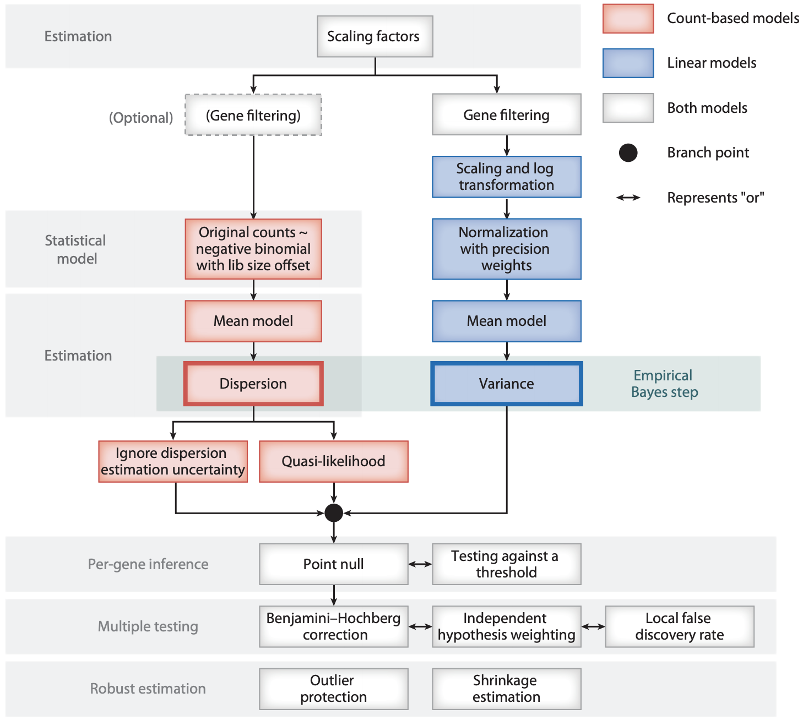
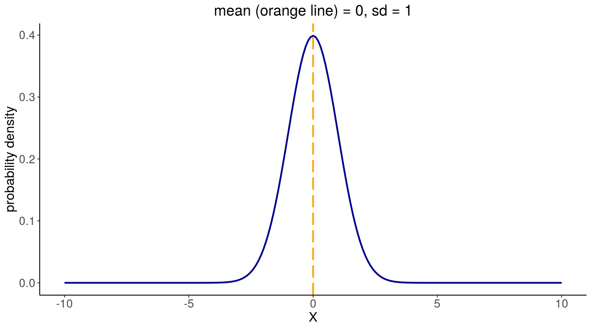
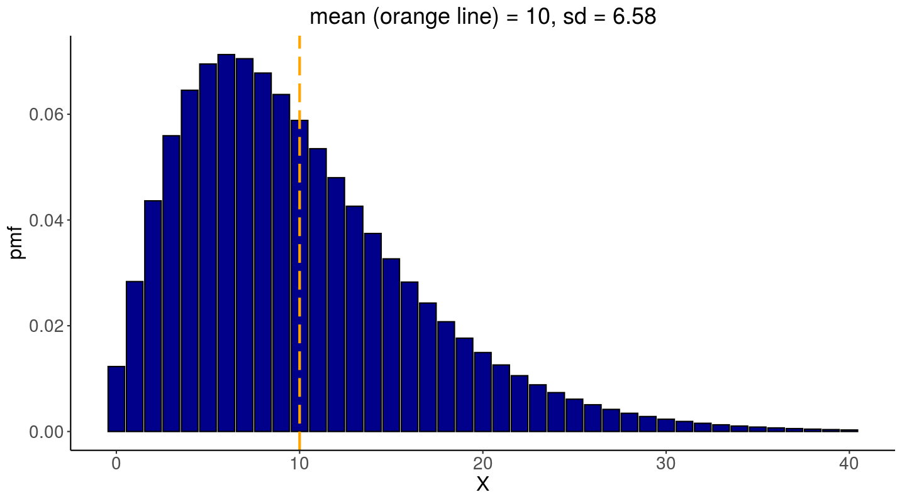

Lecture 2 Differential Expression Analysis (DEA)
========================================================
author: Dennis Hazelett
date: 5/7/2020
autosize: true

RNA-seq: The Goal
========================================================

RNA-seq is a tool of systems biology

_<blockquote>Systems biology is an approach in biomedical research to understanding the larger picture—be it at the level of the organism, tissue, or cell—by putting its pieces together. It’s in stark contrast to decades of reductionist biology, which involves taking the pieces apart.</blockquote>_ 

--Christophe Wanjek ([NIH website](https://irp.nih.gov/catalyst/v19i6/systems-biology-as-defined-by-nih))

- avoid drawing strong conclusions from individual genes
- support conclusions from other types of experiments
- look at groups or clusters of related genes
- same laws of statistics, physics and chemistry apply 

RNA-seq: Workflows
========================================================

A Word About Normalization
========================================================

Normalization has two purposes:

- visualization
- fit data to a statistical model

A Word About Normalization
========================================================

Normalization has two purposes:

- visualization
- fit data to a statistical model

There are two approaches to RNA-seq expression analysis:

- fit data to a model
- fit a model to data

A Word About Normalization
========================================================

Normalization has two purposes:

- visualization
- fit data to a statistical model

There are two approaches to RNA-seq expression analysis:

- fit data to a model <-- normal dist
- fit a model to data

A Word About Normalization
========================================================

Normalization has two purposes:

- visualization
- fit data to a statistical model

There are two approaches to RNA-seq expression analysis:

- fit data to a model <-- normal dist <-- _**normalization**_
- fit a model to data

Types of normalization
========================================================

- Counts per million (CPM)
- Scale, median and mean
- Trimmed mean of M-values (TMM/edgeR)
- Transcripts per million (TPM - Salmon)

A Word About Distributions
========================================================

We discussed two common workflows: DESeq2 and limma/voom

- _**limma/voom**_: log transform of exponential data to fit normal dist

A Word About Distributions
========================================================

We discussed two common workflows: DESeq2 and limma/voom

- _**Deseq2**_ (and _edgeR_): estimation of parameters from raw counts fit to NB dist

A Word About Distributions
========================================================

- Most data, in a _controlled experimental setting_, fit some distribution, often the normal dist.

A Word About Distributions
========================================================

- Most data, in a _controlled experimental setting_, fit some distribution, often the normal dist.
- However, most biological, ecological, epidemiological data, fit other distributions. [Explore these in the distribution zoo](https://ben18785.shinyapps.io/distribution-zoo/)

A Word About Distributions
========================================================

- Most data, in a _controlled experimental setting_, fit some distribution, often the normal dist.
- However, most biological, ecological, epidemiological data, fit other distributions. [Explore these in the distribution zoo](https://ben18785.shinyapps.io/distribution-zoo/)
- It is important to understand the distribution underlying the experiment, as the parameters can be related to the _**data-generating process**_.

A Word About Distributions
========================================================

- Most data, in a _controlled experimental setting_, fit some distribution, often the normal dist.
- However, most biological, ecological, epidemiological data, fit other distributions. [Explore these in the distribution zoo](https://ben18785.shinyapps.io/distribution-zoo/)
- It is important to understand the distribution underlying the experiment, as the parameters can be related to the _**data-generating process**_.
- The underlying assumption in experiments comparing treatment _vs._ control is that the distributions are the same, and the observed distribution parameters reflect systematic biases (experimental error)

A Word About Distributions
========================================================

- Most data, in a _controlled experimental setting_, fit some distribution, often the normal dist.
- However, most biological, ecological, epidemiological data, fit other distributions. [Explore these in the distribution zoo](https://ben18785.shinyapps.io/distribution-zoo/)
- It is important to understand the distribution underlying the experiment, as the parameters can be related to the _**data-generating process**_.
- The underlying assumption in experiments comparing treatment _vs._ control is that the distributions are the same, and the observed distribution parameters reflect systematic biases (experimental error)
- _Some DEA violate these assumptions_, and you should be aware of this when choosing an analysis strategy and interpreting the results.

GENAVi
========================================================

Steps:
- visualize
- choose a model
- differential analysis
- PCA (week 2)
